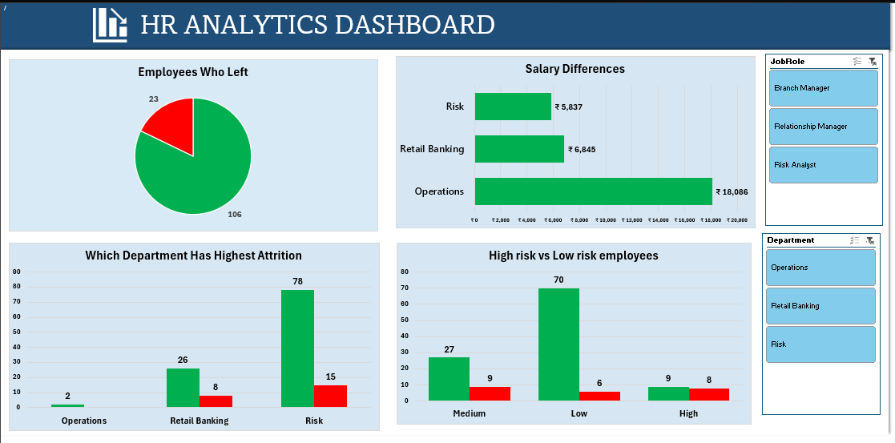
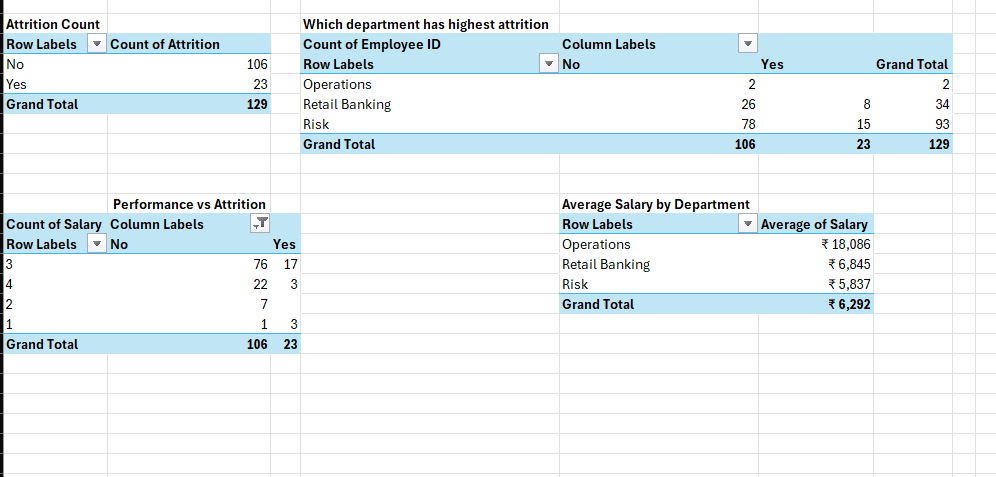
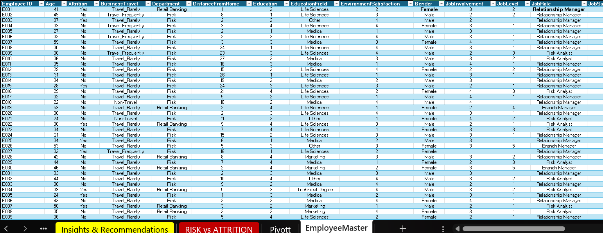
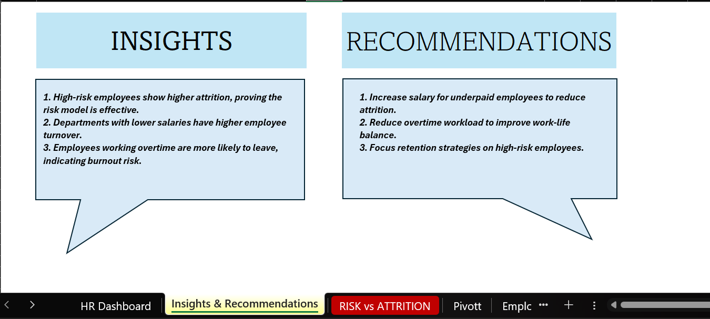
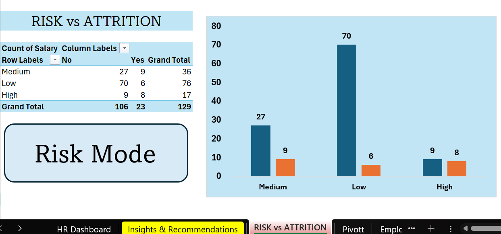

# 🏦 HR Analytics Banking Dashboard (Excel)

## 📌 Project Overview

This project is an interactive **HR Analytics Dashboard** developed in **Microsoft Excel** to analyze employee attrition, department performance, salary distribution, employee risk levels, and workforce trends within the banking sector.

The dashboard enables HR professionals to identify key factors influencing employee turnover and supports data-driven decision-making through interactive visualizations and business insights.

---

## 🎯 Project Objectives

- 📊 Analyze employee attrition trends
- 🏦 Compare department-wise performance
- 💰 Evaluate average salary across departments
- ⚠️ Identify employee risk levels
- 📈 Support HR decision-making using data
- 💡 Provide actionable business recommendations

---

## 🛠️ Tools Used

- 📗 Microsoft Excel
- 📊 Pivot Tables
- 📈 Pivot Charts
- 🎛️ Slicers
- 🧹 Data Cleaning
- 📋 Excel Tables
- 🎨 Dashboard Design
- 📉 Data Visualization

---

## ✨ Excel Features Used

- Pivot Tables
- Pivot Charts
- Slicers
- COUNT
- AVERAGE
- Sorting & Filtering
- Excel Tables
- Conditional Formatting
- Dashboard Formatting

---

## 📊 Dashboard Highlights

- 👥 Employee Attrition Overview
- 🏦 Department-wise Attrition Analysis
- 💰 Average Salary Comparison
- ⚠️ Risk vs Attrition Analysis
- 🎛️ Interactive Job Role & Department Slicers
- 📈 HR Performance Insights

---

## 📋 Dataset Summary

| Metric | Value |
|--------|------:|
| 👥 Total Employees | 129 |
| ✅ Employees Stayed | 106 |
| ❌ Employees Left | 23 |

---

## 📈 Business Questions Answered

- ❓ How many employees left the organization?
- ❓ Which department has the highest attrition?
- ❓ Which department has the highest average salary?
- ❓ How does employee risk impact attrition?
- ❓ Which job roles experience higher employee turnover?
- ❓ What actions can reduce employee attrition?

---

## 💡 Key Business Insights

- 📌 High-risk employees showed significantly higher attrition.
- 📌 Departments with lower average salaries experienced greater employee turnover.
- 📌 Overtime was identified as a major contributor to employee attrition.
- 📌 HR teams can use these insights to improve workforce planning and employee retention.

---

## ✅ Business Recommendations

- 💰 Review compensation for underpaid employees.
- ⚖️ Improve work-life balance by reducing overtime.
- 🎯 Prioritize retention strategies for high-risk employees.
- 📊 Continuously monitor HR metrics for proactive decision-making.

---

## 📂 Project Workflow

1. 🧹 Data Cleaning
2. 📋 Data Preparation
3. 📊 Pivot Table Creation
4. 📈 Data Analysis
5. 🎨 Dashboard Design
6. 💡 Business Insights & Recommendations

---

## 📸 Project Screenshots

### 📊 Dashboard

### 📑 Pivot Summary

### 📄 Raw Data

### 💡 Insights & Recommendations

### ⚠️ Risk vs Attrition

---

## 📦 Project Files

### 📊 Excel Workbook
📄 [HR Analytics Bank Project.xlsx](HR%20Analytics%20Bank%20Project.xlsx)

### 📑 Project Report
📄 [HR-Analytics Bank Report.docx](HR-Analytics%20Bank%20Report.docx)

### 📽️ Project Presentation
📄 [HR Analytics for Banking Sector.pptx](HR%20Analytics%20for%20Banking%20Sector.pptx)

---

## 🚀 Skills Demonstrated

- 📊 Data Analysis
- 🧹 Data Cleaning
- 📈 Dashboard Development
- 📑 Pivot Tables
- 📊 Data Visualization
- 🏦 HR Analytics
- 💼 Business Intelligence
- 📖 Data Storytelling
- 💡 Business Insights & Recommendations

---

## 👩‍💻 Author

**Pudi Roshitha**

🎓 Computer Science Student  
📊 Aspiring Data Analyst

---

⭐ Thank you for visiting this project!
