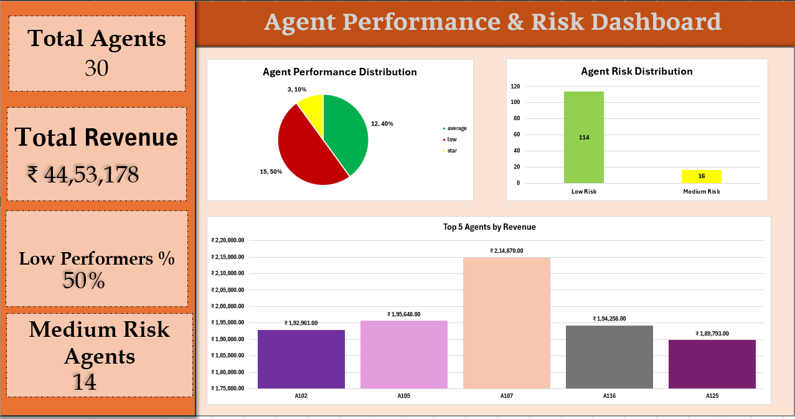
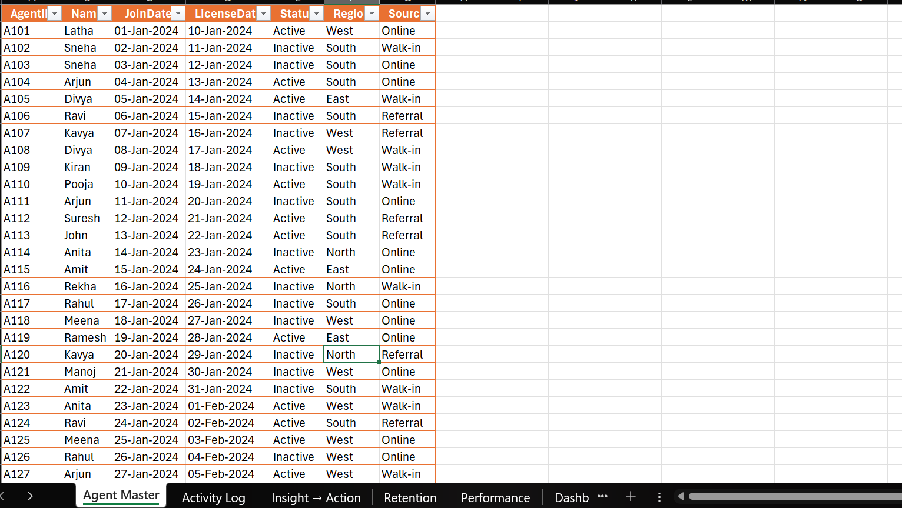
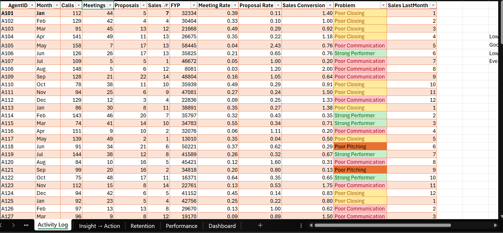
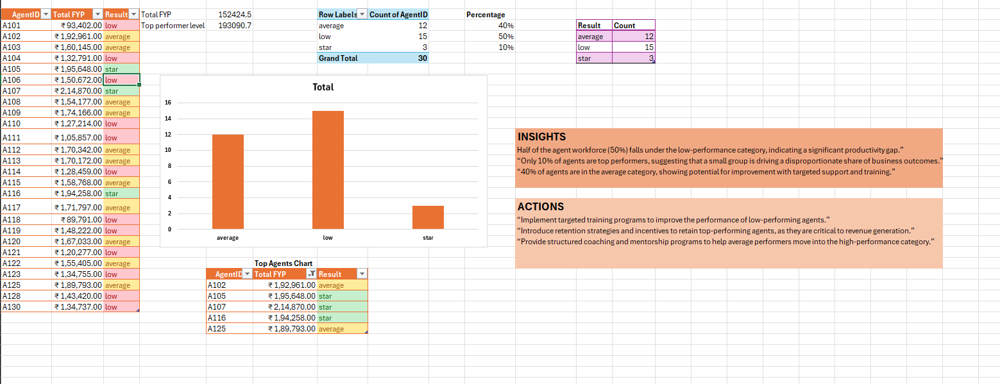
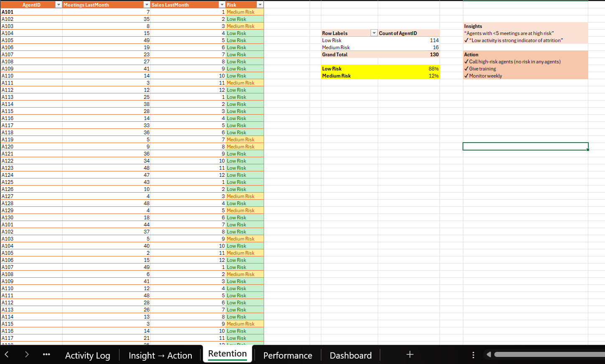
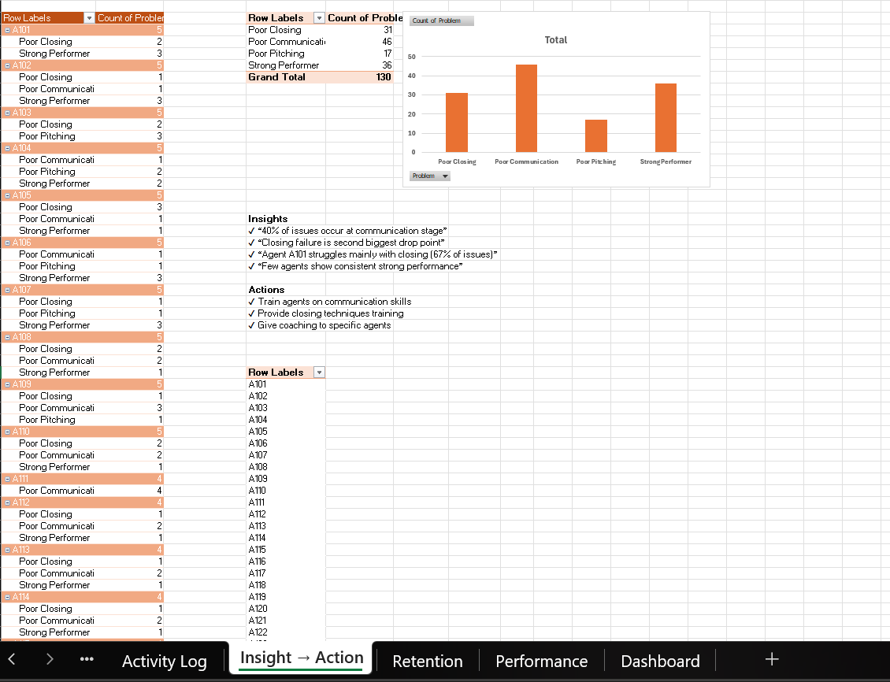

# 📊 Agent Performance & Risk Dashboard (Excel)

## 📌 Project Overview

This project is an interactive **Agent Performance & Risk Dashboard** built in **Microsoft Excel** to analyze agent productivity, revenue generation, performance distribution, retention risk, and business challenges. The dashboard enables managers to monitor KPIs, identify performance gaps, and make data-driven business decisions.

---

## 🎯 Project Objectives

- Analyze agent performance and productivity
- Monitor revenue generation
- Identify top-performing agents
- Evaluate agent retention risk
- Discover key business challenges
- Recommend data-driven improvement strategies

---

## 🛠️ Tools Used

- Microsoft Excel
- Pivot Tables
- Pivot Charts
- Excel Tables
- Data Cleaning
- Dashboard Design
- KPI Cards
- Data Visualization

---

## 📊 Dataset Overview

| Metric | Value |
|--------|------:|
| 👥 Total Agents | **30** |
| 📋 Activity Records | **130** |
| 💰 Total Revenue | **₹44,53,178** |
| 📉 Low Performers | **15 (50%)** |
| 📈 Average Performers | **12 (40%)** |
| ⭐ Star Performers | **3 (10%)** |

---

## 📂 Workbook Structure

- 👤 Agent Master
- 📋 Activity Log
- 📈 Performance Analysis
- ⚠️ Retention Analysis
- 💡 Insight → Action
- 📊 Dashboard

---

## 📊 Dashboard KPIs

| KPI | Value |
|------|------:|
| 👥 Total Agents | **30** |
| 💰 Total Revenue | **₹44,53,178** |
| 📉 Low Performers | **50%** |
| ⚠️ Medium Risk Agents | **14*** |

> **Note:** Verify this KPI. The Retention Pivot shows **16 Medium Risk Agents**, while the dashboard card displays **14**.

---

## 📈 Performance Analysis

### Performance Distribution

| Category | Agents | Percentage |
|----------|-------:|-----------:|
| ⭐ Star | **3** | **10%** |
| 📈 Average | **12** | **40%** |
| 📉 Low | **15** | **50%** |
| **Total** | **30** | **100%** |

---

### 🏆 Top 5 Revenue Generating Agents

| Rank | Agent | Revenue |
|-----:|-------|---------:|
| 1 | A107 | **₹2,14,870** |
| 2 | A105 | **₹1,95,648** |
| 3 | A116 | **₹1,94,258** |
| 4 | A102 | **₹1,92,961** |
| 5 | A125 | **₹1,89,793** |

---

### 💰 Performance vs Bonus

| Performance | Average Bonus |
|-------------|--------------:|
| ⭐ Star | ₹1,292.89 |
| 📈 Average | ₹1,279.13 |
| 📉 Low | ₹1,333.90 |
| **Overall Average** | **₹1,300.59** |

---

## ⚠️ Retention Analysis

| Risk Level | Agents | Percentage |
|------------|-------:|-----------:|
| 🟢 Low Risk | **114** | **88%** |
| 🟡 Medium Risk | **16** | **12%** |
| **Total Records** | **130** | **100%** |

---

## 💡 Performance Issues

| Problem Category | Records |
|------------------|--------:|
| Poor Communication | **46** |
| Strong Performer | **36** |
| Poor Closing | **31** |
| Poor Pitching | **17** |
| **Total** | **130** |

---

## 📊 Dashboard Highlights

- KPI Summary Cards
- Performance Distribution
- Risk Distribution
- Top 5 Revenue Agents
- Performance Analysis
- Retention Analysis
- Business Insights & Recommendations

---

## 💡 Key Business Insights

- 📉 **50%** of agents are classified as low performers.
- ⭐ Only **10%** of agents are star performers.
- 💰 A small group of top-performing agents contributes significantly to total revenue.
- 💬 Poor Communication (**46 cases**) is the most common business challenge.
- 🎯 Poor Closing (**31 cases**) is the second-largest performance issue.
- ⚠️ **88%** of records are classified as Low Risk.
- 📈 Average performers represent strong coaching opportunities.

---

## 🎯 Business Recommendations

- Conduct communication skills workshops.
- Improve closing techniques through targeted training.
- Reward and retain star performers.
- Coach low-performing agents.
- Monitor medium-risk agents regularly.
- Review KPIs monthly using the dashboard.
- Use data-driven insights for performance management.

---

## 📸 Project Screenshots

### 📊 Dashboard

### 👤 Agent Master

### 📋 Activity Log

### 📈 Performance Analysis

### ⚠️ Retention Analysis

### 💡 Insight → Action

---

## 📁 Project Files

📊 [Excel Workbook](HR%20Analytics%20for%20Insurance.xlsx)

📑 [Project Report](HR_Analytics_Insurance_Report.pdf)

📄 [Presentation](HR_Analytics_For_Insurance_Presentation%20.pdf)

---

## 🚀 Skills Demonstrated

- Data Cleaning
- Data Analysis
- Performance Analytics
- Revenue Analysis
- Risk Analysis
- Pivot Tables
- Pivot Charts
- Dashboard Design
- KPI Reporting
- Business Intelligence
- Data Visualization
- Business Storytelling

---

## ❓ Business Questions Answered

- Which agents generate the highest revenue?
- Which agents require coaching?
- How many agents are low performers?
- Which business problem is most common?
- Which agents are at retention risk?
- What actions can improve overall business performance?

---

## 👩‍💻 Author

**Pudi Roshitha**

Computer Science Student | Aspiring Data Analyst

---

⭐ Thank you for visiting this project!
