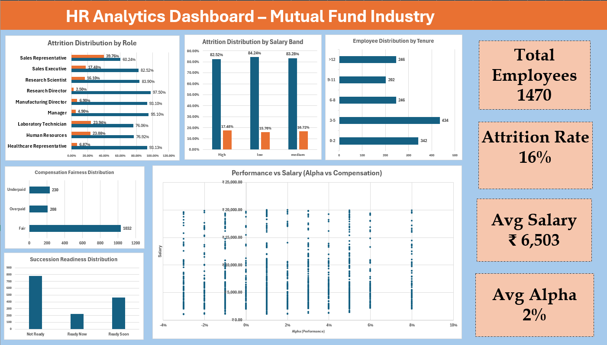
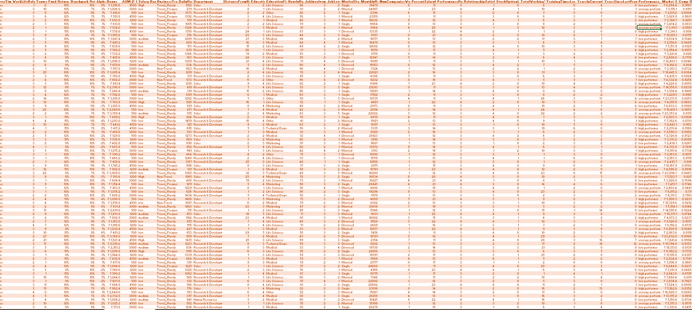
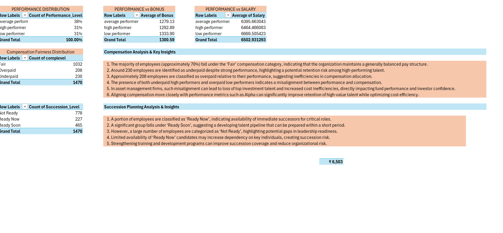
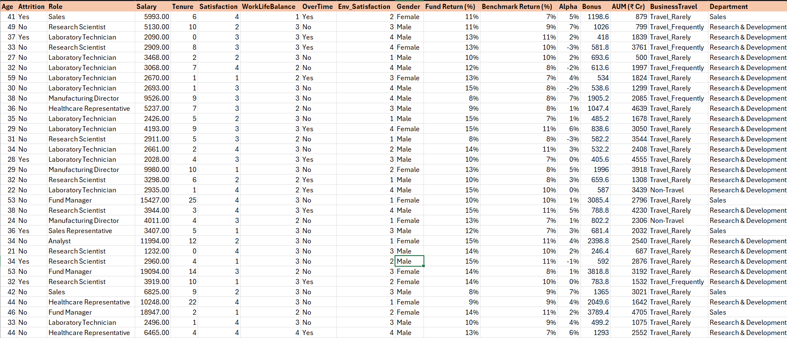
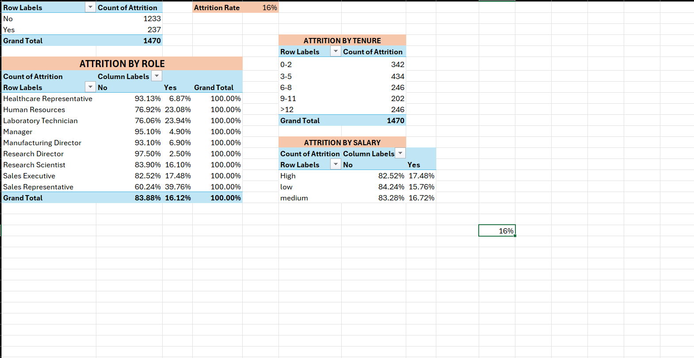
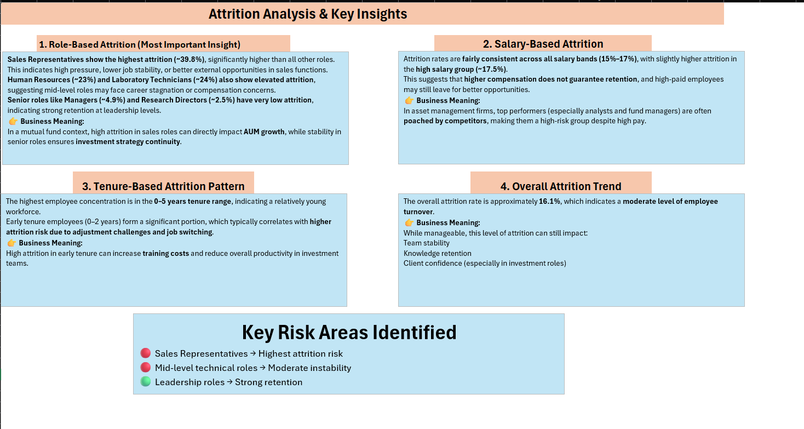

# 💰 HR Analytics Dashboard – Mutual Fund Industry (Excel)

## 📌 Project Overview

This project is an interactive **HR Analytics Dashboard** built in **Microsoft Excel** to analyze workforce trends, employee attrition, compensation fairness, performance, tenure, and succession readiness within the Mutual Fund industry.

The dashboard helps HR professionals identify key workforce challenges, understand employee turnover patterns, evaluate compensation strategies, and support data-driven talent management decisions through interactive visualizations and business insights.

---

## 🎯 Project Objectives

- 📊 Analyze employee attrition across different roles
- 💰 Evaluate compensation fairness
- 📈 Compare employee performance and salary
- 👥 Analyze workforce tenure distribution
- 🚀 Assess succession readiness
- 💡 Generate actionable HR recommendations

---

## 🛠️ Tools Used

- 📗 Microsoft Excel
- 📊 Pivot Tables
- 📈 Pivot Charts
- 🎛️ Interactive Dashboard
- 🧹 Data Cleaning
- 📋 Excel Tables
- 📉 Data Visualization
- 📌 KPI Cards

---

## ✨ Excel Features Used

- Pivot Tables
- Pivot Charts
- KPI Cards
- Scatter Plot
- Bar Charts
- Column Charts
- Excel Tables
- Percentage Calculations
- Dashboard Formatting
- Data Cleaning

---

## 📊 Dashboard KPIs

| KPI | Value |
|------|------:|
| 👥 Total Employees | 1,470 |
| ❌ Employees Left | 237 |
| ✅ Employees Stayed | 1,233 |
| 📉 Attrition Rate | 16.12% |
| 💰 Average Salary | ₹6,503 |
| 📈 Average Alpha | 2% |

---

## 📊 Dashboard Highlights

- 👥 Employee Attrition Overview
- 💼 Attrition by Role
- 💰 Salary Band Analysis
- 📈 Performance vs Salary
- ⚖️ Compensation Fairness
- ⏳ Employee Tenure Distribution
- 🚀 Succession Readiness
- 💡 HR Business Insights

---

## 💡 Key Business Insights

- 🔴 Sales Representatives experience the highest employee attrition.
- 💰 Salary alone does not significantly influence employee retention.
- 📈 Nearly 70% of employees receive fair compensation.
- ⚠️ More than 200 employees are identified as underpaid.
- 👥 Employees with 3–5 years of tenure represent the largest workforce group.
- 🚀 Most employees are classified as "Not Ready" for succession, highlighting leadership development opportunities.

---

## ✅ Business Recommendations

- 💰 Improve compensation for underpaid high performers.
- 🎯 Strengthen retention strategies for Sales Representatives.
- 📈 Align salary growth with employee performance.
- 👥 Enhance onboarding for early-tenure employees.
- 🚀 Invest in leadership development and succession planning.
- 📊 Continuously monitor workforce analytics for proactive HR decisions.

---

## 📦 Project Deliverables

This repository includes:

- 📊 Interactive Excel Dashboard
- 📑 Business Analysis Report
- 📽️ Project Presentation
- 📈 Pivot Table Analysis
- 🧹 Data Cleaning
- 💡 Business Insights & Recommendations

---

## 🚀 Quick Access

📊 [Open Excel Workbook](HR%20Analyst%20in%20Mutual%20Funds.xlsx)

📑 [View Project Report](HR_Analytics_Mutual_Funds_Project_Report.docx)

📽️ [View Presentation](HR%20Analytics%20for%20Mutual%20Funds%20PPT.pptx)

---

## 📂 Project Workflow

1. 🧹 Data Cleaning
2. 📋 Data Preparation
3. 📊 Pivot Table Analysis
4. 📈 Dashboard Development
5. 📉 Business Analysis
6. 💡 Insights & Recommendations

---

## 📸 Project Screenshots

### 📊 Dashboard

### 🧹 Data Cleaning

### 📑 Pivot Summary

### 📄 Raw Data

### 📈 Attrition Analysis

### 💡 Key Insights & Recommendations

---

## 📁 Project Files

📊 [HR Analyst in Mutual Funds.xlsx](HR%20Analyst%20in%20Mutual%20Funds.xlsx)

📑 [HR Analytics Mutual Funds Report](HR_Analytics_Mutual_Funds_Project_Report.docx)

📽️ [HR Analytics for Mutual Funds Presentation](HR%20Analytics%20for%20Mutual%20Funds%20PPT.pptx)

---

## 🚀 Skills Demonstrated

- 📊 HR Analytics
- 👥 Workforce Analytics
- 📉 Employee Attrition Analysis
- 💰 Compensation Analysis
- 📈 Performance Analysis
- 🚀 Succession Planning
- 📑 Pivot Tables
- 📊 Dashboard Development
- 📉 Data Visualization
- 💡 Business Intelligence
- 📖 Storytelling with Data
- 🧹 Data Cleaning
- 📗 Microsoft Excel

---

## 👩‍💻 Author

**Pudi Roshitha**

🎓 Computer Science Student

📊 Aspiring Data Analyst

---

⭐ Thank you for visiting this project!
