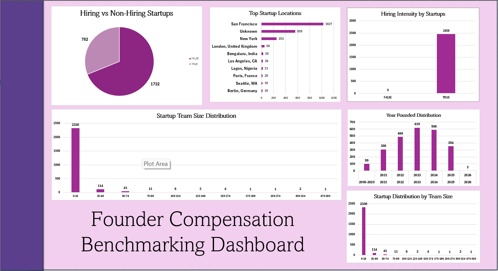
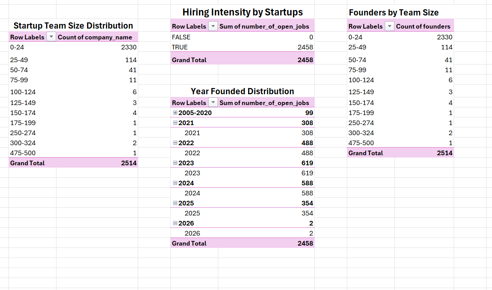
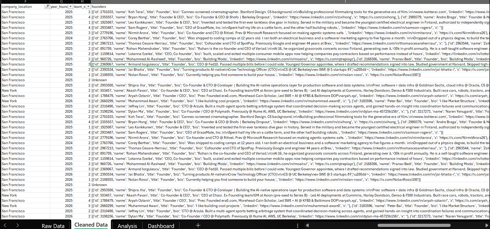
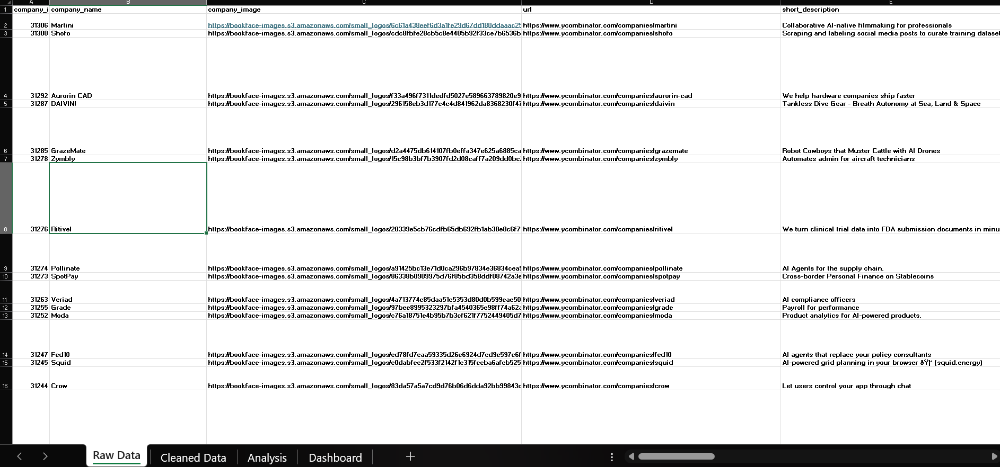

# 📊 Founder Compensation Benchmarking Dashboard (Microsoft Excel)

An interactive Microsoft Excel dashboard that analyzes startup hiring trends, founder compensation data, company distribution, team sizes, and startup growth patterns. This project follows a complete data analytics workflow, transforming raw startup data into meaningful business insights through data cleaning, pivot analysis, and visualization.

---

# 🎯 Project Objective

The objective of this project is to analyze startup ecosystem trends by examining company growth, hiring activity, team size distribution, founding years, and geographical presence. The dashboard helps identify startup patterns and provides insights that support business research and strategic decision-making.

---

# 🛠️ Tools & Features Used

### Tool

- Microsoft Excel

### Excel Features

- Excel Tables
- Data Cleaning
- Pivot Tables
- Pivot Charts
- Dashboard Design
- Data Visualization
- Charts
- Business Analysis
- Professional Formatting

---

# 📊 Dataset Overview

### Total Startups

**2,514**

### Hiring Companies

**2,458**

### Non-Hiring Companies

**0**

### Top Startup Hub

**San Francisco (1,027 Startups)**

### Most Common Team Size

**0–24 Employees (2,330 Startups)**

---

# 📈 Dashboard Highlights

- Hiring vs Non-Hiring Companies
- Startup Distribution by Team Size
- Startup Distribution by Location
- Startup Distribution by Year Founded
- Interactive Business Dashboard

---

# 📑 Pivot Analysis

### Startup Team Size Distribution

| Team Size | Startups |
|-----------|----------:|
| 0–24 | 2,330 |
| 25–49 | 114 |
| 50–74 | 41 |
| 75–99 | 11 |
| 100–124 | 6 |
| 125–149 | 3 |
| 150–174 | 4 |
| 175–199 | 1 |
| 250–274 | 1 |
| 300–324 | 2 |
| 475–500 | 1 |

---

### Hiring Status

| Status | Count |
|---------|------:|
| Hiring | 2,458 |
| Not Hiring | 0 |

---

### Startup Distribution by Year Founded

| Year | Startups |
|------|---------:|
| 2005–2020 | 99 |
| 2021 | 308 |
| 2022 | 488 |
| 2023 | 619 |
| 2024 | 588 |
| 2025 | 354 |
| 2026 | 2 |

---

### Top Startup Locations

- San Francisco
- Unknown
- New York
- London
- Bengaluru
- Los Angeles
- Lagos
- Paris
- Seattle
- Berlin

---

# 💡 Key Business Insights

- 📈 Nearly **92.7%** of startups have fewer than **25 employees**, indicating the dataset is dominated by early-stage companies.
- 🌍 **San Francisco** is the largest startup hub with **1,027 startups**, followed by New York and London.
- 🚀 Most startups in the dataset were founded between **2022 and 2024**, showing strong recent startup growth.
- 👥 Very few companies have teams larger than **150 employees**, highlighting limited representation of mature organizations.
- 📍 **559 companies** have unknown locations, suggesting opportunities for improving data quality and completeness.

---

# 🎯 Business Recommendations

- Improve missing location information to enhance geographical analysis.
- Monitor startup growth trends by comparing founding year with hiring activity.
- Focus investment research on rapidly growing startup hubs.
- Track team size expansion to identify scaling companies.
- Use the dashboard to support startup ecosystem benchmarking and market research.

---

# 💼 Skills Demonstrated

- Microsoft Excel
- Data Cleaning
- Data Transformation
- Pivot Tables
- Pivot Charts
- Dashboard Design
- Data Visualization
- Business Analytics
- Startup Ecosystem Analysis
- Business Intelligence
- Storytelling with Data

---

# ❓ Business Questions Answered

- How many startups are included in the dataset?
- Which locations have the highest number of startups?
- What is the most common startup team size?
- Which years experienced the highest number of startup formations?
- How many companies are actively hiring?
- What trends can be identified from startup growth and distribution?

---

## 📁 Project Files

📊 Excel Dashboard: [Founder Compensation Project.xlsx](Founder%20Compensation%20Project.xlsx)

📄 Project Report: [Founder_Compensation_Report.docx](Founder_Compensation_Report.docx)

🖥️ Presentation: [Founder_Compensation_Benchmarking.pptx](Founder_Compensation_Benchmarking.pptx)

---

# 🖼️ Project Preview

## 📊 Dashboard

## 📋 Pivot Analysis

## 🧹 Clean Data

## 📄 Raw Data

---

## ⭐ Project Summary

This project demonstrates an end-to-end Excel analytics workflow, including data cleaning, pivot table analysis, dashboard development, and business storytelling. It showcases practical Excel skills and the ability to transform raw startup data into meaningful insights, making it a strong portfolio project for aspiring Data Analysts.
